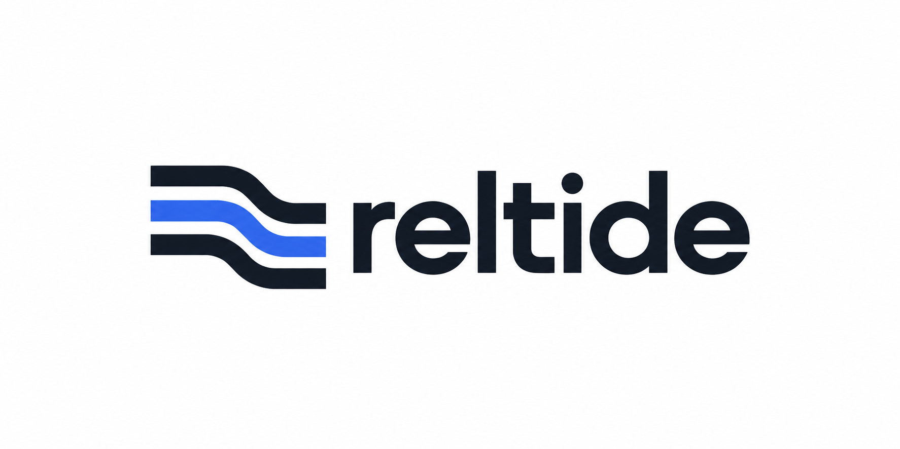

# Reltide



Reltide is an early-stage developer tool for teams that depend on external APIs. It aims to identify breaking changes and prepare tested draft pull requests for engineers to review.

## Local foundation

Use Node `26.9.0` and pnpm `12.6.0` (for example, `npm install -g pnpm@12.6.0`). From a clean checkout:

```bash
pnpm install --frozen-lockfile
pnpm nx show projects --json
pnpm build
pnpm typecheck
pnpm check
```

Start one shell with `pnpm nx run app:dev`, `pnpm nx run web:dev`, or `pnpm nx run docs:dev`. They listen on ports 3000, 3001, and 3004. These initial frontend shells build without credentials or hosted services. They do not yet connect to repositories or run migrations.

The layout keeps next-forge's `apps/` and `packages/` split and selected shared design-system assets. It was adapted from [next-forge commit `f189de7`](https://github.com/haydenbleasel/next-forge/tree/f189de79ceef7c1ef69f61f12e272f99b4cdb699) under its [MIT license](LICENSE.next-forge.md). The three Next.js app shells were generated with `@nx/next` 23.2.1; Nx replaces Turborepo. The upstream Mintlify docs and Next.js backend integrations were removed for the Rust backend and self-hosted Fumadocs plan.

All product backend and worker code belongs in Rust. Platform compute targets Verda in Finland, with Neon EU for application PostgreSQL and Cloudflare R2 EU jurisdiction for private artifacts. `AGENTS.md` records the boundaries and development commands.

TypeScript 5.9.3 is the current compatibility pin: the Nx 23.2.1 generator fails against TypeScript 7.0.2. Upgrade it when the generator and checks support the newer stable release.

## Brand assets

- `assets/reltide-logo.png` — full wordmark
- `assets/reltide-icon.png` — standalone symbol
